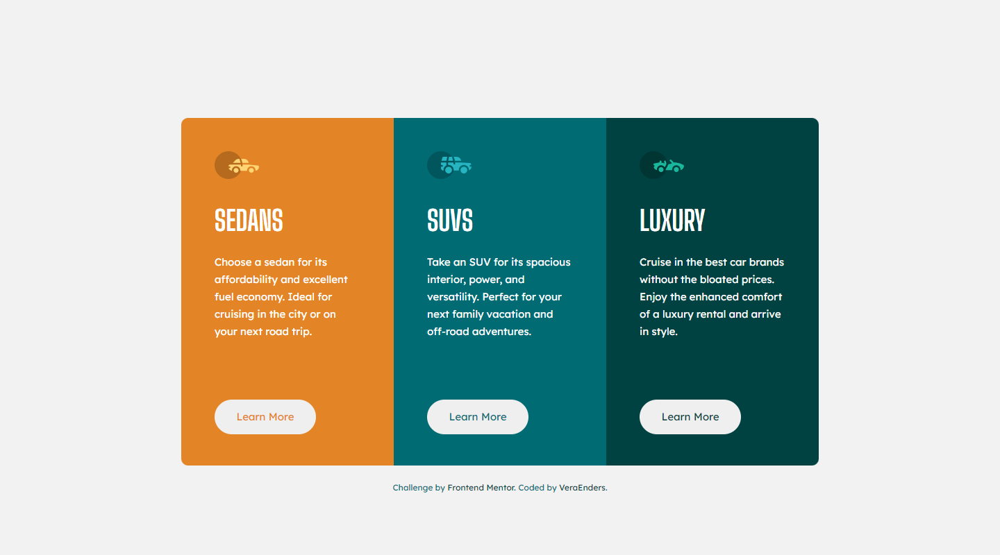
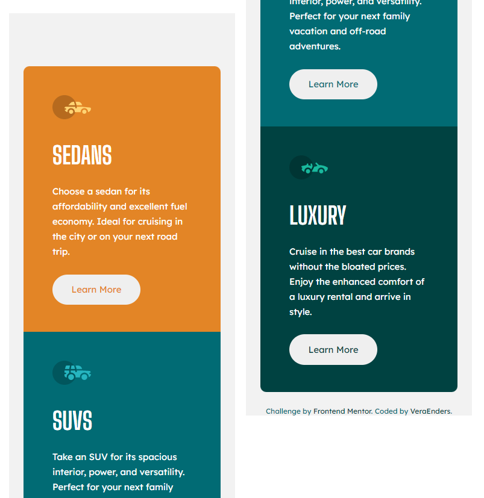

<h1 align="center">Responsive 3-column Card Component</h1>

| Desktop | Mobile |
| --- | --- |
|   |  |

  <h2><a href="https://veraenders.github.io/3-column-preview-card-component/">Live</a>
   |  
  <a href="https://github.com/VeraEnders/3-column-preview-card-component">Code</a></h2>
  
This is a solution to the <a href="https://www.frontendmentor.io/challenges/3column-preview-card-component-pH92eAR2-">3-column preview card component</a> on FrontendMentor.

 

## About the project 
This challenge is to build out 3-column preview card component and get it looking as close to the design as possible. 

Users should be able to:

> View the optimal layout depending on their device's screen size
> See hover states for interactive elements 

## Built with

- Semantic HTML5 markup
- Mobile-first workflow
- CSS Grid
- SASS / SCSS 

## Author

GitHub - [VeraEnders](https://github.com/VeraEnders)

FrontendMentor - [@veraenders](https://www.frontendmentor.io/profile/veraenders)

## Acknowledgments

Many thanks to everyone who read this Readme. If you have any suggestions, feel free to give me feedback. 

I would also like to thank the authors and participants <a href="https://www.frontendmentor.io">frontendmentor.io</a>